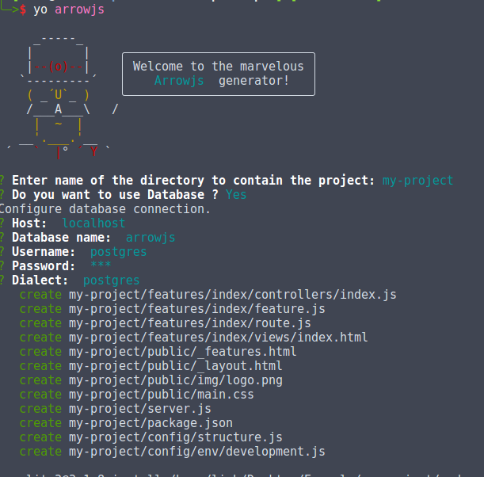
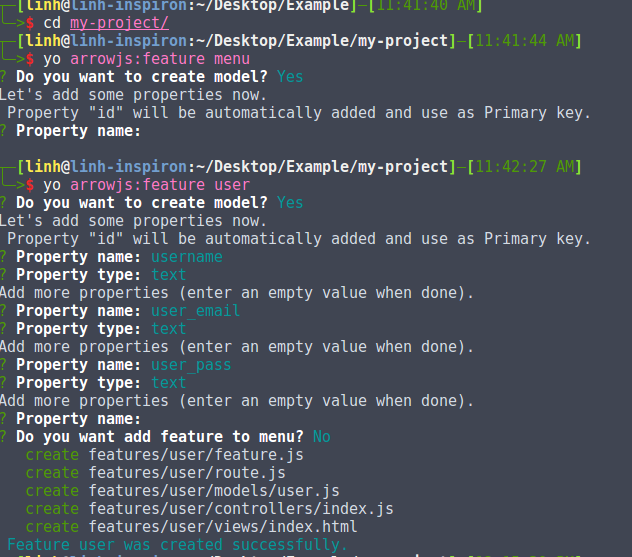
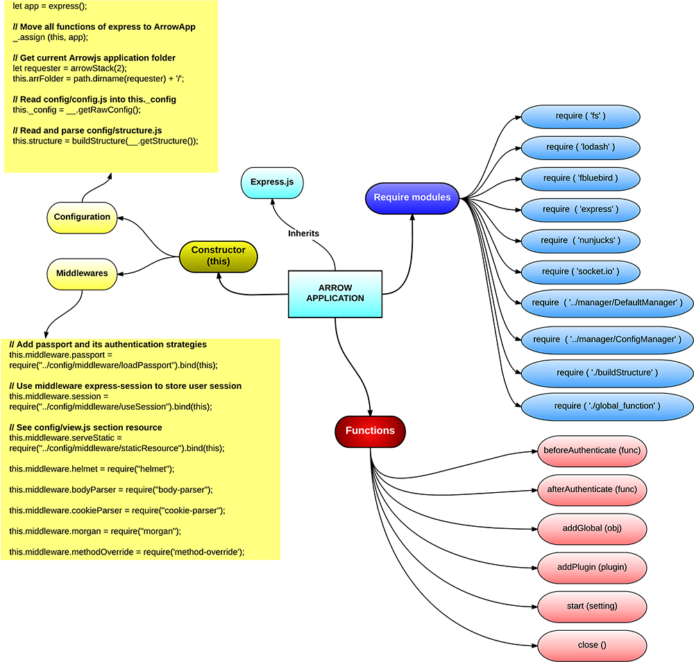

[](https://travis-ci.org/arrowjs/ArrowjsCore)

[](https://codeclimate.com/github/arrowjs/ArrowjsCore)

==================

ArrowJS is framework based on Express.js. It helps you build your web application easier.

```javascript
    'use strict';
    const Arrow = require('arrowjs');
    const application = new Arrow();
    application.start();
```

## Installation

To get started with arrowjs install the ```arrowjs``` package:

```sh
$ npm install arrowjs --save
```

# SET UP ARROWJS CORE
------------------
>>>>>>> efea91df303101da3287591d67614e7d0aef6e0e

## 2 Ways To Use Arrowjs Core Module:
1. Use the stable version in npm 
```bash
  $ cd my-project
  $ npm i --save arrowjs
```

```js
  // in your server.js 
  // require the module from npm
  const Arrow = require('arrowjs');
  const application = new Arrow();
  application.start(); 
```

2. Try the latest version in development in github
* Clone ArrowjsCore to your local computer so that you can refer to it later in your project
```bash
  $ cd /home/user/modules/
  $ git clone https://github.com/arrowjs/ArrowjsCore
```
* After cloning it, you have to install all dependencies of ArrowjsCore so it can work properly
```bash
  $ cd ArrowjsCore/
  $ npm i
```
* Now ArrowjsCore is local at '/home/user/modules/ArrowjsCore'
```js
  // use it by referring to the ArrowjsCore folder
  // in server.js
  const Arrow = require('/home/user/modules/ArrowjsCore');
  const application = new Arrow();
  application.start(); 
```

## Start your project - Run the server and listen on port 8000

```bash
  // open terminal in your project to install dependencies and start server
  $ npm i
  $ node server.js
```

## SETUP ARROWJS PROJECT WITH GENERATOR
### Generate sample Arrowjs project with generator-arrowjs

* Yeoman is a tool that helps you easily generate/ create a complete project structure or templates 
* Each generator creates a project folder structure for each framework e.g. generator-express, generator-react
* Arrowjs also has its own generator that provides a simple Arrowjs folder structure

```bash
// enter the folder you want to store your project
$ cd example

// install yo & generator-arrowjs
$ npm install -g yo generator-arrowjs

// generate sample project structure
$ yo arrowjs

// create feature menu for application my-project
cd my-project && yo arrowjs:feature menu
```

### Generator-arrowjs steps by steps:
```bash
$ yo arrowjs
```


* generator-arrowjs will give us a project structure as below. It quickly sets up the project with all necessary node modules
```
.
├── config
├── features
├── node_modules
├── package.json
├── package-lock.json
├── public
└── server.js
```

* In config, you can write your own configurations such as change database config in development.js
* Update your project structure in structure.js
* Arrowjs Core includes many default configurations e.g. redis, passport for you to use readily
* So your database config in development.js will overwrite default config in arrowjs core
```
// config/
.
├── env
│   └── development.js
└── structure.js
```

```js
// update db config in config/env/development.js
    db: {
      host: 'localhost',
      port: '5432',
      database: 'arrowjs', // this database will automatically created when you runs the server the first time
      username: 'postgres',
      password: 'abc',
      dialect: 'postgres',
      logging: false
    } 
```

* In features, one default component "index" is created
```
// features/index/
.
├── controllers
│   └── index.js
├── feature.js
├── route.js
└── views
    └── index.html
```

### Easily add more features to the project
```bash
// create feature menu
$ cd my-project && yo arrowjs:feature menu
```



* As seen above, you can also set up database model that goes with this feature e.g. quickly create a user table in database with 4 columns (id, username, user_email, user_pass)
* Notes: the table is not immediately created at this moment but when the server is started

```bash
// now we can start the server 
node server.js
// go to port 8000 - render default features/index/views/index.html
```

## Useful links

* [Arrowjs.io Core examples](https://github.com/arrowjs/examples) 
* [Documentation](https://github.com/arrowjs/Documents)

## ArrowjsCore Structure

- `ArrowjsCore/libs/ArrowApplication.js`

ArrowApplication is a singleton object. It is heart of Arrowjs.io web app. it wraps Express and adds following functions: support Redis, multi-languages, passport, check permission and socket.io / websocket

This picture below shows overview of `ArrowApplication.js` structure .


    

## License

The MIT License (MIT)
