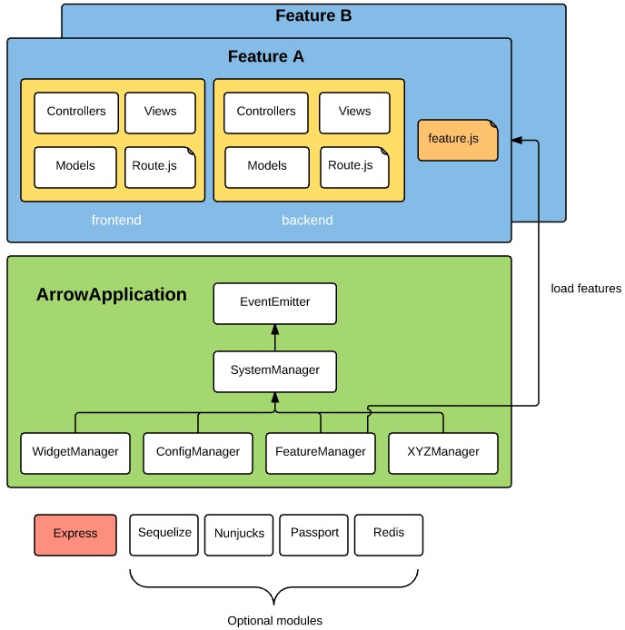
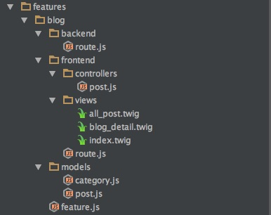

Feature
========================
Feature represents one unit of feature in web application. A feature consists of Model, View, Controller, Route.

- Model: data structure and data object that is fetched from back end database. In early version, we support Postgresql. Later on we will support MongoDB, MySQL,...
- View: View template = HTML + Nunjucks syntax, CSS, JavaScript
- Controller: Javascript file contains handler functions for different HTTP requests
- Router: Direct HTTP request to appropriate handler functions in controller




## Folder structure of feature


Folder structure of a feature is governed by [structure.js](./structure.md). In common web application, a feature may have more than one subfolders: 

- *frontend* sub folder: It is customer facing part for end user.
- *backend* sub folder: It is back office operational part for administrator, operator.

A feature may have only *frontend* sub folder or *backend* subfolder or more than that. Below is extract of controller section in structure.js. There are sub folders *backend* and *frontend*. When you implement new feature, you may skip one of them but creating new sub folder different with *backend* and *frontend* will not be recognized when Arrowjs app parses.

Example of feature that have backend and frontend sub folders.

```
controller: [
    {
        path: {
            name: "backend",
            folder: "backend/controllers",
            file: "*.js"
        }
    },
    {
        path: {
            name: "frontend",
            folder: "frontend/controllers",
            file: "*.js"
        }
    }
]
```

Example of feature that has a single, direct sub folder named *controllers*

```
controller: [
    {
        path: {     
            folder: "controllers",
            file: "*.js"
        }
    }    
]
```


## Create a feature manually
In booting process, Arrowjs web application will parse and load all features in folder *features*. Developer can create feature manually or use Yeoman generator to generate scaffold of feature.

To create a feature manually.

```
    mkdir <name>
    cd <name>
    touch feature.js
```
<name> is real name of feature such as: blog, order, event_calender. Please don't use space in feature name.

feature.js is required configuration file for feature.

```
'use strict';

module.exports = {
    name: "index" // if not exist, Arrowjs will use feature folder name instead
    title: "Index Module", //display in feature management in back end
    author: 'Tran Quoc Cuong', 
    version: '0.1.0',
    description: "Hello Arrowjs",
    permissions: [
        {
            name: 'index',  //key of permission
            title: t('m_users_backend_rule_index')  //description of permission in localized language
        },
        {
            name: 'create',
            title: t('m_users_backend_rule_create')
        },] 
    };

```

## Create a controller inside a feature
In this example, we are going to create a controller sub folder inside a feature then create index.js. index.js contains functions that handles HTTP requests we need map in route.js

```
    cd <feature name>
    mkdir controllers
    cd controllers
    touch index.js
```

Below is example index.js that has one handler function responses back to browser "Hello Arrowjs"

```
module.exports = function (controller,component,application) {
    controller.index = function (req,res) {
       res.send("Hello Arrowjs");
    };
}
```
Developer can access properties 5 parameters passed in:

- controller > controller object itself
- component > feature object that contains controller
- application > Arrowjs application object
- req > [request object](http://expressjs.com/api.html#req)
- response > [response object](http://expressjs.com/api.html#res)

## Create a route inside a feature

If a feature contains several sub folder controllers such as *frontend* and *backend* then we need seperate route.js for each sub folder controller

At one URL path, we can map several HTTP verbs such as: post, get, delete, put. Example of route.js. 

```
'use strict';
module.exports = function (component,application) {
    return {
        "/": {
            get : {
                handler: component.controllers.index
            }
        },
        "/neworder": {
            post : {
                handler: component.controllers.newOrder
            }
        }
    }
};
```

## Create view template inside a feature

In fact, a view template is HTML file that include [Nunjucks](http://mozilla.github.io/nunjucks/) syntax. Each page layout needs one view template. Nunjucks allows to [include](http://mozilla.github.io/nunjucks/templating.html#include), [import](http://mozilla.github.io/nunjucks/templating.html#import) and [extend](http://mozilla.github.io/nunjucks/templating.html#extends) a view template.

If you use PHPStorm or WebStorm, you should use .twig file extension for view template then install [twig plugin](https://plugins.jetbrains.com/plugin/7303?pr=) to highlight Nunjucks syntax.


## Render HTML and response to browser in handler function
A common flow in MVC web application is :

- Browser sends a HTTP request to web application
- Using routes loaded in boot time, Web app maps this request to appropriate handler function
- Handler function may fetch or update data from or to model then render view

To render view you need to use either [res.render](http://expressjs.com/api.html#res.render) or component.render.

For simplicity, just use res.render

```
module.exports = function (controller,component,application) {
     controller.index = function (req,res) {
        res.render("index.twig");
      };
    }
```

Use component.render when you want to use promise function

```
component.render("index"). then(functiont(html){
 res.send(html)
})
```

To push data from controller to view:

```
    res.render("index.twig", {title : "Hello ArrowJS"});
```

## Create a model
Arrowjs uses [Sequelize](http://docs.sequelizejs.com/en/latest/) as Object Relation Mapping between SQL database to models. We, original developers of Arrojws, have been using [Postgresql](http://www.postgresql.org/) 9.4 intensively in several Arrowjs application. However you may use other SQL databases such as MySQL, MariaDB, SQLite and MSSQL.
Please refer to [Model definition](http://docs.sequelizejs.com/en/latest/docs/models-definition/) in Sequelize to know how to define a model.

Example of User model with three fields: id, username and password:

```
var bcrypt = require('bcrypt');

module.exports = function (sequelize,Datatypes) {
    var User = sequelize.define('user', {
        id : {
            type: Datatypes.INTEGER,
            primaryKey : true,
            autoIncrement : true
        },
        username: {
            type: Datatypes.STRING,
            unique: true
        },
        password: {
            type: Datatypes.STRING,
        },
    }, {
        freezeTableName : true,
        hooks : {
            beforeCreate: function (user, op, fn) {
                if(user.password) {
                    bcrypt.hash(user.password,10, function (err, hash) {
                        if(err) throw  err;
                        user.password = hash;
                        fn(null, user);
                    })
                } else {
                    user.password = '';
                    fn(null, user);
                }
            }
        }
    })

    User.sync();
    return User
}
```

## Get data from model
Please refer to section [Querying of Sequelizejs](http://docs.sequelizejs.com/en/latest/docs/querying/) for detail. Below are just some simple examples:

Find a record by ID

```
    component.models.[model_name].findById(id)
```

Get all records in model

```
    application.models.[model_name].findAll(condition)
```

