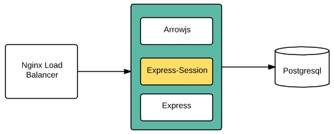

Session
========================
Session is mechanism that stores information of user between requests in period time. For example, in shopping web site, user may order several different items. He puts each item into shopping cart then check out. How can shopping web site remember order list of different customers when they have not yet logined. Session will be used to store order list temporarily.

Another alternative is using cookie to store user information in browser while session store data in server side.

In Express web application, developer use a middle-ware [Express-Session](https://www.npmjs.com/package/express-session) to store and retrieve data to / from session.

Basic configuration as below diagram:


A high traffic web site must be scaled out to several Node.js processes. Nginx acts as a load balancer in fronts Node.js processes. If each Node.js process stores session locally then we have synchronize data among all sessions. It is complex task.

The better solution is use a Redis server to store session. Module [connect-redis](https://www.npmjs.com/package/connect-redis) bridges Express-Session to Redis server.


Arrowjs supports both storing session in Express-Session or external storage such as [Redis](https://www.npmjs.com/package/connect-redis), [MongoDB](https://www.npmjs.com/package/connect-mongo). See more at section [Compatible Session Stores](https://github.com/expressjs/session).

#### Default Settings
In *config* folder, a file name *session.js* defines how we store session.

Arrowjs uses express-session by default. When Arrowjs is configured to connect Redis server correctly, it will use redis-session automatically.

```
module.exports = {
   secret: "helloArrow", // Key to encrypt sessionID
   key: 'sid', // sessionID name to save in cookie 
   resave: true, 
   saveUninitialized: true, // basic config of express-session to advoid deprecate error
   cookie : {
       httpOnly: true // must be used in browser
   },
   redis_prefix : "sess : " //key used in Redis server to differentiate with other data
};
```

