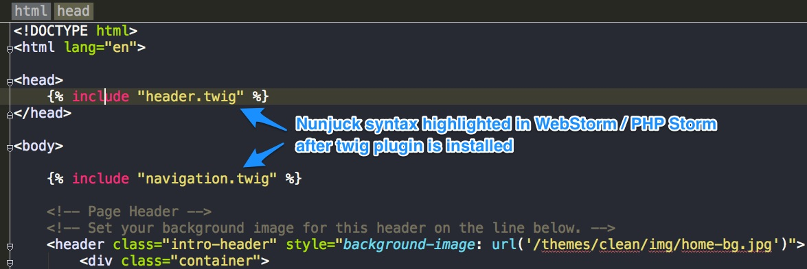
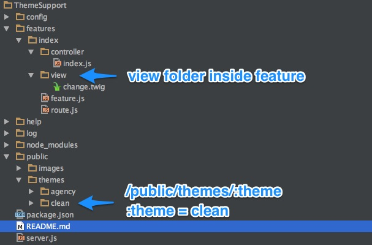

Theme switching
==================
## Quick start
To start this example
```node server.js```

Open web browser and navigate to http://localhost:8000

Click on button "Change Theme" to switch between "[clean](http://startbootstrap.com/template-overviews/clean-blog/)" and "[agency](http://startbootstrap.com/template-overviews/agency/)" theme.

Arrowjs.io uses Nunjucks as default template. Theme are set of Nunjucks templates with CSS, JavaScript and images files.


## Nunjucks Syntax

[Nunjucks Syntax](https://mozilla.github.io/nunjucks/) is similar with [Twig syntax](http://twig.sensiolabs.org/). Assume that you use WebStorm or PHP Storm to code and highlight by [twig plugin](https://plugins.jetbrains.com/plugin/7303?pr=). If you have pure HTML, CSS,  JavaScript web template, you need to change extension of .html file to .twig so WebStorm or PHPStorm can highlight Nunjucks syntax properly.


##Define locations of themes and view templates in configure/structure.js

Theme defines consistent look of web site. While view templates co-exists with controller and routes in feature folder. 
A feature may have several view templates. Common CMS feature such as blog post will use view templates in theme folder. You may buy a commercial theme and change .html to Nunjucks template, add Nunjucks logic then adjust links to static resources.

All themes should be placed in the folder ```/public/themes```.
In the view section of file ```config/structure.js```,  we define one or more locations of view templates.

```
view : {
  path :{
    folder : ["/public/themes/:theme","view"]
  }
}
```

In above example, we define two folders:

* /public/themes/:theme: a theme folder named by :name parameter in /public/themes
* view: view template folder inside feature folder



##Default theme and view template extension
The configure file ```config/view.js``` defines ```viewExtension``` by default is ```twig``` and ```theme``` in this example is "clean". There will be a folder named clean in ```/public/themes```

```
module.exports = {
    resource : {
        path : 'public',
        option : {
            maxAge: 3600
        }
    },
    viewExtension : "twig",
    pagination: {
        number_item: 20
    },
    theme: "clean"
};
```

## Switching Theme

User may change theme on fly without rebooting Node.js app. Look at method ```controller.changeTheme``` in file ```features/index/controller/index.js```


```
    controller.changeTheme = function (req,res) {
        let theme = req.query.theme || "clean";
        application.setConfig("theme",theme).then(function () {
            res.render('change', {theme: application.getConfig('theme')});
        });
    }
```

## Serve static resources of theme

A view template ```/public/themes/clean/index.twig``` modified from [clean theme](http://startbootstrap.com/template-overviews/clean-blog/) will be rendered when request to front page ```/``` comes.
index.twig includes header.twig. In header.twig, there are several references to CSS files.
In ```/config/view.js``` we defined ```resource.path = public``` therefore, we use absolute paths to refer to CSS files:

```
<link href="/themes/clean/css/bootstrap.min.css" rel="stylesheet">

<!-- Custom CSS -->
<link href="/themes/clean/css/clean-blog.min.css" rel="stylesheet">
```

## Use Nginx to serve static resources
It is common practice to use Nginx as proxy in front of Node.js web application. Nginx can act as a load balancer to 
distribute requests to several Node.js web applications behind. Nginx also serves static resource such as images, CSS,
front end javascript much better than express.

From original HTML web template site, we need to change URL of static resources properly so in both development mode
(without Nginx) and production mode (with Nginx), all static resource will return successfully.

This is typical configuration in nginx.conf to configure Nginx as proxy and serve static resource at folder ```/YourWebAppPath/public```


```
location / {
   proxy_pass http://localhost:8000;
   proxy_http_version 1.1;
   proxy_set_header Upgrade $http_upgrade;
   proxy_set_header Connection 'upgrade';
   proxy_set_header Host $host;
   proxy_cache_bypass $http_upgrade;
}

location ~ ^/(images/|img/|javascript/|js/|css/|stylesheets/|flash/|media/|static/|robots.txt|humans.txt$
  root /YourWebAppPath/public;
  access_log off;
  #expires max;
}
```
For detail see whole nginx.conf at ```/nginx/nginx.conf```